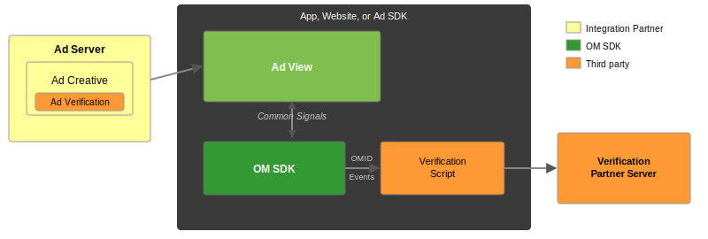
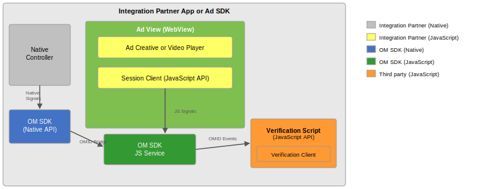
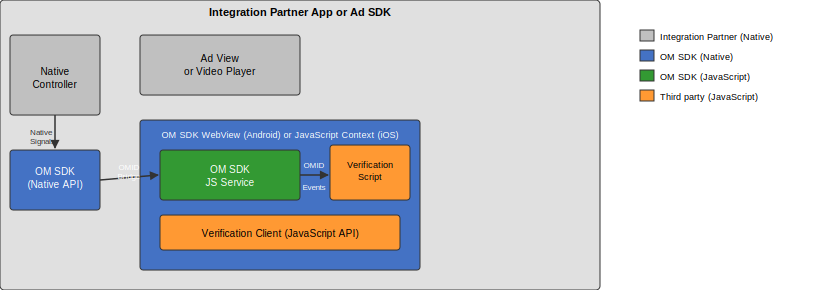
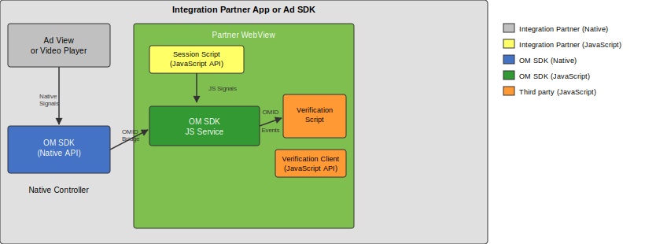
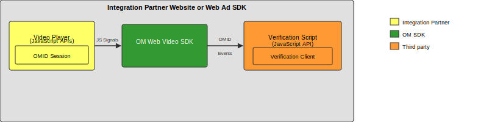
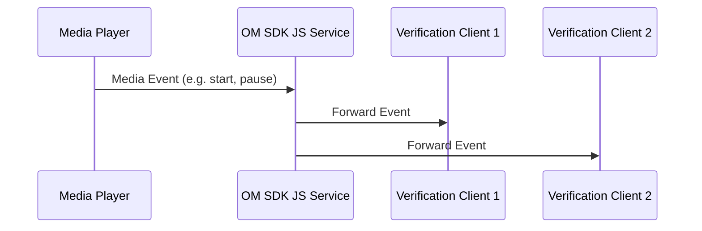
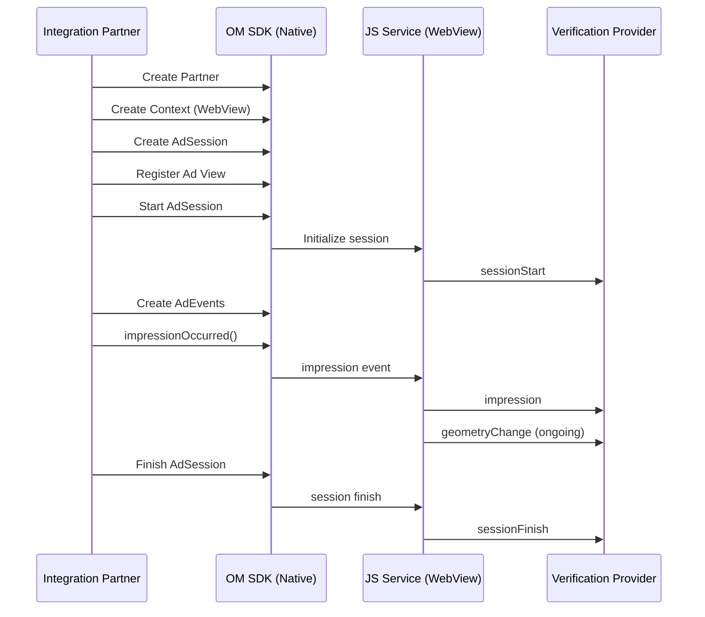
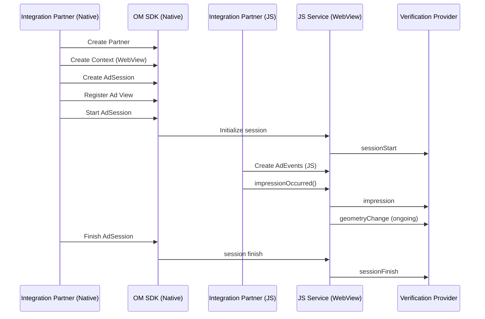
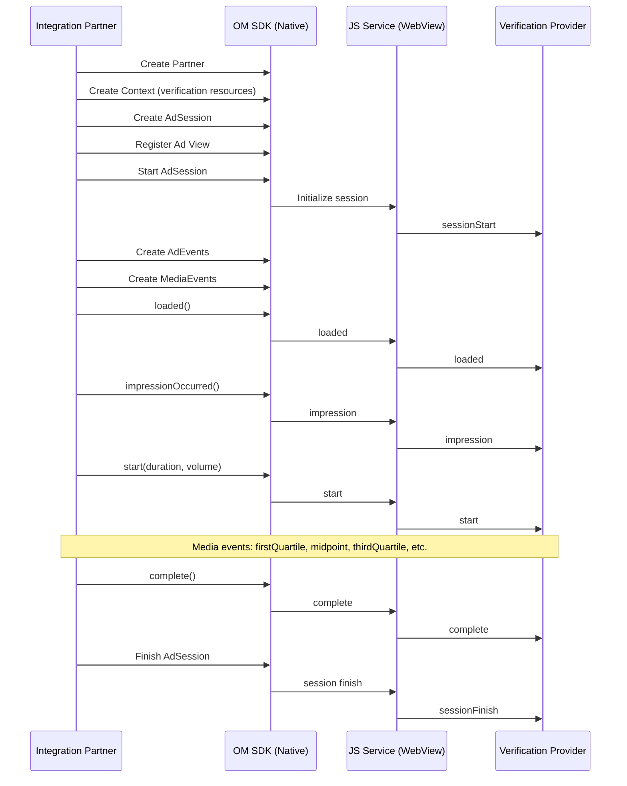
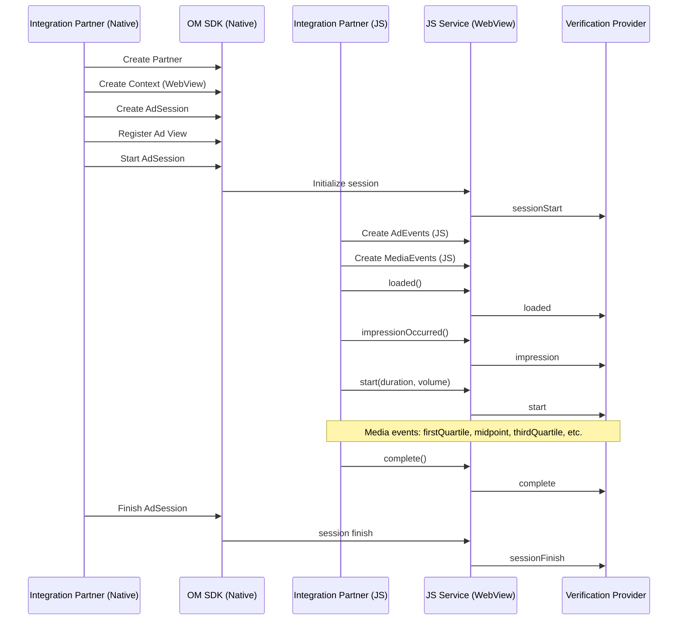

# OMID API Specification

**Version 1.5 | June 2024**

## Executive Summary

The Open Measurement Interface Definition (OMID) API is designed to facilitate third party viewability and verification measurement for ads served to mobile app, web video, and CTV environments.

OMID enables standard communication from any supporting Advertising Software Development Kit (Ad SDK) to any supporting measurement tag, removing the need for multiple integrations specific to each Measurement Provider (or "Ad Verification Service Provider"). This document covers the details of the OMID API.

The Open Measurement Software Development Kit (OM SDK) is designed to facilitate OMID support for Ad SDK implementations, by delivering large parts of the OMID API on their behalf.

OM SDK consists of a native library for iOS & Android operating systems as well as a JavaScript library. App and Web Video/Audio Publishers, or their Ad SDK providers must integrate the OM SDK to ensure proper interoperability with supporting Measurement Providers.

The OMID API and OM SDK are developed and managed by the [Open Measurement Working Group (OMWG)](https://iabtechlab.com/working-groups/open-measurement-working-group/).

### Audience

This API document is designed for Ad SDK providers, App and Web Video/Audio Publishers and Measurement Providers to understand the API details.

More information on OM SDK available at: https://www.iabtechlab.com/omsdk

## About IAB Tech Lab

The IAB Technology Laboratory is an independent, international, research and development consortium charged with producing and helping companies implement global industry technical standards. Comprised of digital publishers and ad technology firms, as well as marketers, agencies, and other companies with interests in the interactive marketing arena, the IAB Tech Lab's goal is to reduce friction associated with the digital advertising and marketing supply chain, while contributing to the safe and secure growth of the industry.

Learn more about IAB Tech Lab here: https://www.iabtechlab.com/

## Open Measurement Working Group

### Commit Group Members

| | |
|---|---|
| DoubleVerify | HUMAN |
| Google | Nielsen |
| Integral Ad Science | Oracle Advertising and Customer Experience |
| IAB Tech Lab | Pandora |

### Working Group Members

A full list of working group members may be found here:
https://iabtechlab.com/working-groups/open-measurement-working-group/

## Introduction

The following documents the OMID API, which is implemented in the OM SDK distributions that target mobile app, web video/audio, and CTV environments. The term "integration partner" is used throughout this document to include both dedicated Ad SDKs providers and publishers that integrate OM SDK directly in their apps or websites.

### OMID and OM SDK Architecture (Overview)

The diagram below shows a simplified view of how the OM SDK enables third party measurement in Partner apps and Ad SDKs. Ad Verification scripts are embedded in HTML or VAST creatives. OM SDK measures the ad view and sends OMID events to verification scripts running in the OMID.

<!-- Source: assets/architecture-overview.drawio -->


### Ad Session

Central to the OMID API is the ad session which enables the integration partner to manage its lifecycle. Ad Sessions can be managed in native code, in JavaScript, or distributed across native and JS layers. This API has been designed to support a number of integration scenarios ("Session Types") which are described below.

#### OM Native SDKs

OM Native SDKs support three ad session types: HTML, JavaScript, and native. When using HTML or JavaScript ad sessions, OM SDK expects all JavaScript components to be executed within the WebView provided by the integration partner. HTML ad sessions signal that OM SDK is executed alongside the rendered ad creative in the provided WebView, whereas JavaScript and native sessions signal that WebViews are not used for presenting the ad creative. For native ad sessions, OM SDK will supply a JavaScript execution environment.

##### HTML Ad Sessions

<!-- Source: assets/html-ad-session.drawio -->


- The ad creative is rendered in the WebView provided by the integration partner.
- The integration partner manages the ad session either using the native Ad Session API or using the native JS-Managed Session Service API in combination with the JavaScript Ad Session API.
- The integration partner signals ad impressions using either the native or JavaScript Ad Events API.
- For video or audio sessions using an HTML5 media player, the integration partner communicates playback state using the JavaScript Media Events API.

##### Native Ad Sessions

<!-- Source: assets/native-ad-session.drawio -->


- The ad creative is rendered using native UI components other than a WebView.
- The integration partner manages the ad session using the native Ad Session API.
- The integration partner signals ad impressions using the native Ad Events API.
- For video or audio sessions, the integration partner communicates media playback state using the native Media Events API.
- OM SDK constructs and maintains an internal JavaScript execution environment.

##### JavaScript Ad Sessions

<!-- Source: assets/javascript-ad-session.drawio -->


- The ad creative is rendered using native UI components and provides a WebView for JavaScript execution. The WebView is not used for displaying the ad creative.
- Like HTML sessions, the integration partner manages the ad session either using the native Ad Session API or using the native JS-Managed Session Service API in combination with the JavaScript Ad Session API.
- Like HTML sessions, the integration partner signals ad impressions using either the native or JavaScript Ad Events API.
- For video or audio sessions, the integration partner communicates media playback state using either the native or JavaScript Media Events API.

##### OM Web Video SDK

<!-- Source: assets/web-video-sdk.drawio -->


- The OM Web Video SDK always uses HTML sessions.
- The video or audio player is rendered via HTML in a website or web application.
- The integration partner manages ad sessions using the JavaScript Ad Session API.
- The integration partner signals ad impressions using the JavaScript Ad Events API.
- The integration partner communicates video or audio playback state using the JavaScript Media Events API.

All ad session scenarios mentioned above support two registration API methods; one for ad view registration which enables OM SDK to identify which view should be considered for viewability and another API for registering friendly obstructions which OM SDK will exclude from viewability calculations.

For any integration partners wishing to use the OMID JS ad session API, this has been designed to be shared as source. Each JavaScript ad SDK will include OMID JS ad session client code within their existing script and minified using their existing processes.

### OM SDK JS Service

Because OM SDK is designed to support both native only and native + JS ad sessions we have introduced a central OM SDK JS service which collects all events from both ad session providers and is then responsible for notifying all registered OMID JS clients of any ad session / state changes.

The OM SDK JS service also provides a detection mechanism which the OMID JS client will use so verification providers can apply the correct measurement strategy.

For HTML ad sessions it is important that integration partners ensure OMID JS service has been injected prior to starting any ad session and loading verification provider scripts. For native ad sessions we require the integration partner to provide the downloaded OMID JS service content when creating any new ad session context.

### OMID JS Verification Client

The OMID JS verification client is a utility that interfaces directly with the OMID JS service both for detection and subscribing to ad session events. This verification client will also handle communication for both friendly and unfriendly placements (i.e. cross-domain iFrames). We recommend that all clients use this API when interested in OMID events.

We have designed the OMID JS verification client to be shared as source and for each verification provider to include this within their existing script and minified using their existing processes.

### Media Events

Because of the number of video and audio player implementations available across the advertising ecosystem as well as challenges where JS players may not have direct access to the top level window (i.e. cross-domain iFrames) we support integration partners to provide media events to ad sessions running in OM SDK. Each media player can select the most appropriate implementation for publishing media playback state changes to OM SDK.

Once the event has been received by the OM SDK JS service these will then be shared with all registered OMID JS clients.



For any integration partners wishing to use the OMID JS Media Events API this has been designed to be shared as source and for each HTML5 video player to include this within their existing script and minified using their existing processes.

### OM SDK Namespace Builds

The OM SDK build process supports both namespace and generic OM SDK library builds. The generic builds use the class and package names described in this document. Namespaced builds rename the classes and package names to allow ad SDK integrators to include OM SDK in their SDKs without conflicting with other Ad SDKs. Ad SDKs and Apps must use the namespaced version of OM SDK.

### OM SDK JS Service Injection Strategies

For HTML ad sessions each integration partner is responsible for ensuring that the OM SDK JS service has been injected into the WebView prior to any additional JS components.

For native ad sessions each integration partner is expected to download and provide the OM SDK JS service content when creating new ad session contexts. Any attempt to create an ad session without a valid OM SDK JS service will result in an error.

Below we have detailed some possible solutions to OM SDK JS service injection for HTML ad sessions.

#### Server-side OM SDK JS Service Script Content Injection

This injection strategy relies on the ad server being responsible for downloading the OM SDK JS service script content and modifying the original HTML ad response.

1. Ad server requests and caches the OM SDK JS service script content.
2. Integration partner creates a new OMID ad session.
3. OMID enabled ad request received by the ad server.
4. Ad server modifies the HTML ad response to prepend OM SDK JS service script content — for example: `<script>downloaded/cached OM SDK JS service script content</script><<ORIGINAL TAG HTML CONTENT>>`.
5. Integration partner receives HTML ad response and injects content into the registered WebView.
6. Integration partner notifies OM SDK that the ad session can be started.

This solution assumes that the ad server will take responsibility for ensuring that OM SDK JS service script content is correctly injected into the HTML ad response across the variety of supported tags.

> **Note:** This is the recommended OM SDK JS service injection solution as this provides the most flexibility when it comes to updating any injection rules without impacting the client integration.

#### Client-side OM SDK JS Service Script Content Injection

This injection strategy relies on the integration partner assuming responsibility for downloading and caching the OM SDK JS service from their CDN. Once available the integration can choose between using the OMID script injection API or implement their own injection strategy using the downloaded script content.

1. Integration partner SDK will download / cache their AVID JS service resource.
2. Integration partner creates a new OMID ad session.
3. OMID enabled ad request received by the ad server and unmodified ad response sent back to integration partner.
4. If OM SDK JS service download is complete then use the OMID script injection API to modify HTML ad content. If OM SDK JS service download is not yet complete then wait for download callback.
5. Integration partner injects the modified content into the registered webview.
6. Integration partner notifies OMID that the ad session can be started.

When it comes to using the OMID script injection API the following rules will apply:

- If the HTML ad response contains no `<html>`, `<head>` or `<body>` then the script content will be prepended to the HTML.
- If the HTML ad response contains a `<html>` element with no `<head>`, but a `<body>` element then the script content will be added as the first child element of the `<body>`.
- If the HTML ad response contains a `<html>` element with both `<head>` and `<body>` elements then the script content will be added as the first child element of the `<head>`.
- If the HTML ad response contains a `<html>` element with no `<head>` or `<body>` elements then the script content will be added as the first child element of the `<html>`.
- If the HTML ad response contains a `<!DOCTYPE html>` element with no `<html>`, `<head>` or `<body>` elements then the script content will be added as the first child element of the `<!DOCTYPE html>`.

This implementation will also cater for situations where any element has been commented out — for example, `<html><!-- <head></head> --><body></body></html>`. In this example the script content will be added as the first child element of the `<body>`.

The OMID script injector will also be able to handle self-closing tags — for example: `<html><head/><body>...</body></html>` will be converted into `<html><head>script</head><body>...</body></html>`.

## Ad Session Lifecycle

The OMID API is designed to support a variety of integration styles. The diagrams below cover these in more detail and explain how the OMID API should be used in each scenario.

> **Important:** Creating an OMID ad session in the native layer sends a message to the OM SDK JS Service running in the WebView. If the OM SDK JS Service has not completed loading before the ad session is created, the message is lost, and the verification scripts will not receive any events. To prevent this, the implementation must wait until the WebView finishes loading OM SDK JS before starting the OMID ad session.

> **Important:** Ending an OMID ad session sends a message to the verification scripts running inside the WebView supplied by the integration. So that the verification scripts have enough time to handle the `sessionFinish` event, the integration must maintain a strong reference to the WebView for at least 1.0 seconds after ending the session.

**Platform-specific notes:**
- **Android:** For all ad sessions that are created, `finish` must be called once the ad session is no longer required, otherwise memory will be leaked.
- **iOS:** For all ad sessions that are started, `finish` must be called once the ad session is no longer required, otherwise memory will be leaked.

### Display Ad Session with No Contributing JS Ad Session

The below diagram demonstrates the OMID display ad session lifecycle where the integration partner wishes to only use the full native OMID API.



### Display Ad Session with a Contributing JS Ad Session

The below diagram demonstrates the OMID display ad session lifecycle where the integration partner wishes to use both the native and JS OMID API.



### Video Ad Session with Native Video Player

The below diagram demonstrates the OMID video ad session lifecycle using a native video player.



### Video Ad Session with HTML Video Player

The below diagram demonstrates the OMID video ad session lifecycle using an HTML video player.



### Supporting Verification Script Resources in VAST

Unlike HTML ad formats where all verification clients will be loaded using the more traditional `<script src="..."></script>` HTML element, for video ad formats we will be using VAST XML ad responses as detailed below.

#### VAST Version 4.1 Support via Ad Verifications Node

Below is an example of how to include verification information in VAST 4.1 tags. Please refer to the VAST 4.1 specification for exact usage of different parameters in the `<AdVerifications>` node.

```xml
<!-- VAST version 4.1 OMID example -->
<AdVerifications>
  <Verification vendor="company.com-omid">
    <JavaScriptResource apiFramework="omid" browserOptional="true">
      <![CDATA[https://verification.com/omid_verification.js]]>
    </JavaScriptResource>
    <TrackingEvents>
      <Tracking event="verificationNotExecuted">
        <![CDATA[https://verification.com/trackingurl/[REASON]]]>
      </Tracking>
    </TrackingEvents>
    <VerificationParameters>
      <![CDATA[verification params key value pairs]]>
    </VerificationParameters>
  </Verification>
</AdVerifications>
```

#### Pre-VAST Version 4.1 Support via a Custom Extension

For older versions of VAST documents namely VAST 2.0, VAST 3.0 or VAST 4.0, verification code should be loaded via the `Extensions` node specifying `Extension type` as `AdVerifications`. The root element is `AdVerifications` node with the same schema as the VAST 4.1 `AdVerifications` node.

```xml
<!-- Pre-VAST version 4.1 OMID example -->
<Extensions>
  <Extension type="AdVerifications">
    <AdVerifications>
      <Verification vendor="company.com-omid">
        <JavaScriptResource apiFramework="omid" browserOptional="true">
          <![CDATA[https://verification.com/omid_verification.js]]>
        </JavaScriptResource>
        <TrackingEvents>
          <Tracking event="verificationNotExecuted">
            <![CDATA[https://verification.com/trackingurl]]>
          </Tracking>
        </TrackingEvents>
        <VerificationParameters>
          <![CDATA[verification params key value pairs]]>
        </VerificationParameters>
      </Verification>
    </AdVerifications>
  </Extension>
</Extensions>
```

## Android / Android TV OMID Library API

### Usage

#### Check for OMID Compatibility and Library Activation

1. Verify that `Omid` class exists (this is important only when the integration partner is using a shared OMID library).
2. Check if OMID has already been activated by calling `Omid.isActive()`.
3. If not activated, execute `Omid.activate(applicationContext)`. In Android TV applications, OMID should be activated in `MyApplication.onCreate()`.

#### Publish Activity Events (Required for Android TV Integrations)

1. After activating Omid in `MyApplication.onCreate()`, the integration should also call `Omid.updateLastActivity()`.
2. Signal to OM SDK when a user interacts prior to viewing an ad by calling `Omid.updateLastActivity()`.

#### Load and Inject OM SDK JS Script Content into Tag Response (Optional)

1. Each integration partner is responsible for downloading and caching the OM SDK JS service ready for use in the OMID ad session.
2. Once the OM SDK script content has been downloaded then OMID JS injection can be performed by calling `ScriptInjector.injectScriptContentIntoHtml`.

#### Using the OMID Ad Session API

1. Create a new `Partner` object.
2. Create a new `Context` object specifying the `Partner` and either a `WebView` instance or a list of verification script resources.
3. Create a new `AdSession` object specifying the `Context`.
4. Once ready, start the ad session executing `AdSession.start`.
5. Once started you can now record ad session events — see ad events and video events detailed below.
6. All ad session errors should be recorded calling `AdSession.error`.
7. Once the ad session has finished, execute `AdSession.finish`.

#### Handling Ad Session Ad Events

1. Create `AdEvents` object specifying the `AdSession` instance.
2. Notify the ad session when an impression has occurred by calling `AdEvents.impressionOccured`. This step can be ignored if the JS ad session controls when the impression event should be triggered.

#### Handling Ad Session Media Events (Video and Audio Only)

For HTML video ad sessions this will be handled by the JS ad session.

1. Create `MediaEvents` object specifying the `AdSession` instance.
2. Update media player implementation to trigger the appropriate media events during content loading / playback.

#### Thread Safety

OMID library functions must be called only from the main UI thread of the application.

### API Reference

https://docs.iabtechlab.com/omsdk-docs-1.4/android/index.html

## iOS / tvOS OMID Library API

### Usage

#### Set up OMID

1. Verify that `OMIDSDK` class exists.
2. Check `OMIDSDK.isActive` to determine if OM SDK has already been activated.
3. If not, call `-[OMIDSDK activate]`. In tvOS applications, OMID should be activated in `[MyAppDelegate application:didFinishLaunchingWithOptions:]`.

#### Publish Activity Events (Required for tvOS Integrations)

1. Signal to the SDK when a user interacts with the app by calling `[[OMIDSDK sharedInstance] updateLastActivity]`.

#### Set up an Ad Session

1. Create an `OMIDPartner` object.
2. If using OMID-managed verification JS, create an `OMIDVerificationResource` for each verification URL/file.
3. Create an `OMIDAdSessionContext` object with WebView or verification script resources.
4. Create an `OMIDAdSession` object.
5. Start the ad session.

#### Report on the Ad Lifecycle and Media Ad Events

1. Create `OMIDAdEvents` and `OMIDMediaEvents` objects if required.
2. Call `AdEvents` and `MediaEvents` methods as needed.

#### Thread Safety

OMID library functions must be called only from the main UI thread of the application.

### API Reference

https://docs.iabtechlab.com/omsdk-docs-1.4/ios/index.html

## OMID JS Ad Session Client API

API Reference: https://docs.iabtechlab.com/omsdk-docs-1.4/js/index.html

The API detailed below should be used where the integration partner relies on JS components when contributing to the ad session state. This API can be used in the following scenarios:

1. Video ad session relying on the HTML5 video player for injecting verification script resources and/or publishing OMID video events.
2. Display ad session relying on a separate JS component to handle the impression event.

| Class | Reference |
|-------|-----------|
| `Partner` | [docs](https://docs.iabtechlab.com/omsdk-docs-1.4/js/Partner.html) |
| `VerificationScriptResource` | [docs](https://docs.iabtechlab.com/omsdk-docs-1.4/js/VerificationScriptResource.html) |
| `Context` | [docs](https://docs.iabtechlab.com/omsdk-docs-1.4/js/Context.html) |
| `OmidVersion` | [docs](https://docs.iabtechlab.com/omsdk-docs-1.4/js/OmidVersion.html) |
| `AdSession` | [docs](https://docs.iabtechlab.com/omsdk-docs-1.4/js/AdSession.html) |
| `AdEvents` | [docs](https://docs.iabtechlab.com/omsdk-docs-1.4/js/AdEvents.html) |
| `MediaEvents` | [docs](https://docs.iabtechlab.com/omsdk-docs-1.4/js/MediaEvents.html) |

### VastProperties

**Constructor Summary:** See [API docs](https://docs.iabtechlab.com/omsdk-docs-1.4/js/AdEvents.html).

### VideoPlayerState

| Value | Description |
|-------|-------------|
| `minimized` | The player is collapsed in such a way that the video is hidden. |
| `collapsed` | The player has been reduced from its original size. |
| `normal` | The player's default playback size. |
| `expanded` | The player has expanded from its original size. |
| `fullscreen` | The player has entered fullscreen mode. |

### InteractionType

| Value | Description |
|-------|-------------|
| `click` | The user clicked to load the ad's landing page. |
| `invitationAccept` | The user engaged with ad content to load a separate experience. |

## OMID JS Verification Client API

The Open Measurement SDK (OM SDK) project provides a way for verification providers to measure ad inventory using a common interface across many environments. The OMID JS Verification Client API is the endpoint of that interface: the methods and events that are exposed to verification code. This API may also be adopted by (non-OMWG) third-parties in order to enable OMID verification scripts to measure their inventory.

### Verification Client

The OM SDK project publishes the OMID JS Verification Client, a JavaScript library which should be integrated into all OMID verification resources. This utility understands the different underlying mechanisms that might be used to access OMID data and exposes a single consistent interface to verification code. It is designed to work with all direct OM SDK integrations, but will also be compatible with third-party implementations of the OMID JS Verification Client API which follow the implementation guide.

#### Non-Browser Environments

The OMID JS Verification Client includes several methods essential for verification code (e.g. `setTimeout`) but that would be unavailable when running in certain non-browser environments (e.g. iOS' JavaScriptCore) where many common functions are not provided. When executed in a standard browser or WebView, the library will automatically fallback to built-in functionality.

#### Integration

The standard process for working with the OMID JS client includes:

1. Copy the OMID JS client source code into your project
2. Create new OMID JS client instance
3. Interface with OMID JS client in order to access OMID state
4. Ensure OMID JS client has been included as part of any minification process

> **Note:** The OMID JS client source code is available and has been designed to be minified as part of the JavaScript build process.

### VerificationClient

Constructor Summary: https://docs.iabtechlab.com/omsdk-docs-1.4/js/VerificationClient.html

## OMID Events

### Event Objects

All events passed to verification code session observers or event listeners are objects containing the following properties.

| Property | Type | Description |
|----------|------|-------------|
| `adSessionId` | string | The Ad Session ID, a unique value provided by the OMID implementer for tracking individual ad lifecycles. |
| `type` | string | The type of event this object represents. |
| `timestamp` | number | The time this event originally occurred. This may not be the current time, as events may be cached and replayed for late loading verification code. |
| `data` | Object | Only available for particular event types. Certain events include additional data containing more specific details about the triggering event. See individual event definitions for details. |

```javascript
// Example: OMID Event Subscription
omidClient.addEventListener('volumeChange', function(evt) {
  console.log(
    'Session ' + evt.adSessionId +
    ' changed volume to ' + evt.data.videoPlayerVolume +
    ' at ' + evt.timestamp
  );
});
```

### Event Caching

OMID providers will cache events which may have been missed by late loading verification code. Following event subscription, any previously events that previously occurred will be passed to event handlers in chronological order. The `timestamp` property of the event objects will indicate when the event was originally fired.

### Session Events

These events are all subscribed to implicitly when calling `registerSessionObserver`. These events should not be explicitly subscribed to via the `addEventListener` method.

```javascript
// Example: Subscribing to session events
const vendorKey = 'verify.com-omid';

function observeSession(evt) {
  const sessionId = evt.adSessionId;
  if (evt.type == 'sessionFinish') {
    handleSessionEnd(sessionId);
  } else if (evt.type == 'sessionError') {
    logError(sessionId, evt.data.errorType, evt.data.message);
  } else {
    // Handle sessionStart event.
    const vendorData = parseParams(evt.data.verificationParameters);
    startMonitoring(sessionId, evt.data.context, vendorData);
  }
}

omidClient.registerSessionObserver(observeSession, vendorKey);
```

#### sessionStart

This event fires as soon as the OMID provider has initialized and has the necessary data to fill in the context and `verificationParameters` of the event data, following a call to `registerSessionObserver`. It does not imply that the ad has rendered or the video has started playing; it only marks the initialization of the ad session. This is always the first event fired for a session.

**Event Data**

| Property | Type | Description |
|----------|------|-------------|
| `context` | Context | An object describing the static properties of the playback environment. See [Context Object](#context-object) for details. |
| `verificationParameters` | string | The per-vendor initialization parameters for this session observer. Only provided if `registerSessionObserver` was called with a `vendorKey` argument matching a known vendor+parameters pair. In the case of VAST-served video ads, these pairs come from the `<Verification>` element. |
| `mediaType` | string | The media type measured in the ad session. |
| `creativeType` | string | The type of ad creative being measured in the ad session. |
| `impressionType` | string | Impression type makes it easier to understand discrepancies between measurers of the ad session. |
| `supportsLoadedEvent` | boolean | Whether the `loaded` event is supported. |
| `contentUrl` | string | In `web` environment, the URL of the top-level web page. In `app`, Android deep link or iOS universal link. |
| `lastActivity` | object | The most recent user interaction; either provided by the integrator or measured directly by OM SDK. Example: `{"timestamp": 1688029344570}` |

##### Context Object

| Property | Type | Description |
|----------|------|-------------|
| `apiVersion` | string | The version of the OMID JS Verification Client API provided (`"1.0"` for this document). |
| `environment` | string | `"app"` (mobile app, any integration involving a native layer) or `"web"` (web-only, no native layer). |
| `accessMode` | string | See [Access Mode Values](#access-mode-values). |
| `videoElement` | HTMLVideoElement | Required for all `"full"` accessMode linear video ads, or any ad where a `<video>` element is the main focal point of the creative. For video creatives that do not use HTML5 video at all, `slotElement` may be used instead. |
| `slotElement` | Element | Required for `"full"` accessMode display ads, or for any video ad where no `<video>` element is used. This is the HTML element inside which the creative is rendered. |
| `adSessionType` | string | See [Ad Session Type Values](#ad-session-type-values). |
| `adServingId` | string | The `<AdServingId>` value of the current ad from the VAST, if available. |
| `transactionId` | string | The `[TRANSACTIONID]` value of the ad request chain, as defined in VAST 4.1. |
| `podSequence` | string | The value of the `sequence` attribute from the `<Ad>` of the current session. Matches the `[PODSEQUENCE]` macro in VAST 4.1. |
| `adCount` | number | The number of `<InLine>` ads played within the current chain or tree of VASTs, including the executing one. Matches the `[ADCOUNT]` macro in VAST 4.1. |
| `omidNativeInfo` | Object | Only present when a native layer is involved. See [omidNativeInfo](#omidnativeinfo). |
| `omidJsInfo` | Object | See [omidJsInfo](#omidjsinfo). |
| `app` | Object | Required for mobile app and CTV integrations. See [app](#app-object). |
| `deviceInfo` | Object | Required for mobile app and CTV integrations. See [deviceInfo](#deviceinfo-object). |
| `supports` | Array\<string\> | A list of optional features implemented in the current environment. Value `"clid"` indicates `geometryChange` event is always provided. |
| `customReferenceData` | string | Optional. Key reference data related to the ad session. |
| `friendlyToTop` | boolean | Whether the SDK has access to the top window. |
| `deviceCategory` | string | Category of device: `"ctv"`, `"desktop"`, `"mobile"`, or `"other"`. Undefined if cannot be determined. |
| `sessionOwner` | string | Required only for `"app"` environments. `"native"` or `"javascript"`. |

###### Access Mode Values

| Value | Description |
|-------|-------------|
| `limited` | Verification code is executed in a sandbox with only indirect information about the ad. Geometry information is provided through OMID events (e.g. `geometryChange`). |
| `full` | Verification code is executed with direct access to the video or rendering element (not sandboxed). A reference to the element will be provided via `videoElement` or `slotElement`. |
| `domain` | **[Not Recommended]** Verification code is loaded in an iframe via `src` attribute via a domain loader resource on the Publisher's domain. Contact omsdksupport@iabtechlab.com for details. |

###### Ad Session Type Values

| Value | Description |
|-------|-------------|
| `native` | Control of the ad session is directed from the native layer; JavaScript code is run in a DOM-less environment. |
| `html` | Control of the ad session is directed from a web layer. |
| `javascript` | Control of the ad session is directed from the native layer but it uses WebViews for running JavaScript code. |

###### omidNativeInfo

Only present when a native layer is involved in the ad session.

| Property | Type | Description |
|----------|------|-------------|
| `partnerName` | string | The name of the native layer OM SDK integration partner. |
| `partnerVersion` | string | The version of the native layer OM SDK integration partner. |

```json
{
  "partnerName": "exampleNativeSDK",
  "partnerVersion": "1.0.0"
}
```

###### omidJsInfo

| Property | Type | Description |
|----------|------|-------------|
| `omidImplementer` | string | The name of the OMID provider. For OM SDK integrations this is always `"omsdk"`. |
| `serviceVersion` | string | For OM SDK integrations, the version of the OM SDK JS service used. For third-party implementations, the version of the OMID provider code. |
| `sessionClientVersion` | string | The version of OM SDK JS ad session client used. Required for OM SDK integrations where a JavaScript SDK contributes to the ad session. |
| `partnerName` | string | The name of the JS-level integration partner, if one exists. |
| `partnerVersion` | string | The version of the code provided by the party from `partnerName`. |

```json
{
  "omidImplementer": "omsdk",
  "serviceVersion": "1.0.0",
  "sessionClientVersion": "1.0.0",
  "partnerName": "exampleJsSdk",
  "partnerVersion": "3.4.2"
}
```

###### app Object

Required for mobile app and CTV integrations.

| Property | Type | Description |
|----------|------|-------------|
| `libraryVersion` | string | Required only for `"app"` environments. The version of the compiled native OM SDK library used. |
| `appId` | string | The bundle or package name of the mobile or CTV application. |

###### deviceInfo Object

Required for mobile app and CTV integrations.

| Property | Type | Description |
|----------|------|-------------|
| `deviceType` | string | Name or model of the device (e.g. `"iPhoneX"`, `"UA50AUE60AKLXL"`). |
| `os` | string | Name of the operating system (e.g. `"iOS"`, `"tvOS"`, `"Android"`, `"webOS"`, `"tizen"`). |
| `osVersion` | string | Operating system version (e.g. `"11.1.2"`). |

#### sessionError

This event is fired following a playback, rendering, or other ad-related error, which may be session terminal or recoverable. In the case of non-recoverable errors, this event does not replace `sessionFinish`, which still must be fired following the `sessionError` event.

**Event Data**

| Property | Type | Description |
|----------|------|-------------|
| `errorType` | string | `"video"` (video-related rendering or loading errors) or `"generic"` (catch-all for other issues). |
| `message` | string | Description of the session error. |

#### sessionFinish

This event is fired when the ad session has terminated and indicates that verification resources should clean up and handle end-of-session reporting. This is always the last event sent for a session.

**Event Data:** None.

### Lifecycle and Metric Events

Verification code can subscribe to these events using the `addEventListener` method.

#### impression

The OMID provider has recorded an impression for this ad. For video ads, this corresponds to the VAST `<Impression>` and should be fired simultaneously with that event.

**Event Data**

| Property | Type | Description |
|----------|------|-------------|
| `mediaType` | string | `"display"` or `"video"`. |
| `creativeType` | string | `"htmlDisplay"`, `"nativeDisplay"`, `"video"`, or `"audio"`. |
| `impressionType` | string | See [Impression Type Values](#impression-type-values). |
| `videoEventAdaptorType` | string | Only for OM SDK video impressions. `"jsCustom"` or `"nativeCustom"`. |
| `videoEventAdaptorVersion` | string | Only when `videoEventAdaptorType` is provided. Version of the video event adaptor code. |
| `viewport` | Object | Only when accessMode `"limited"`. `{ width: number, height: number }` |
| `adView` | AdView | Only when accessMode `"limited"`. The ad geometry at impression time. See [AdView Object](#adview-object). |

##### Creative Type Values

| Value | Description |
|-------|-------------|
| `htmlDisplay` | Creatives measured using display methodology that are trafficked as HTML. |
| `nativeDisplay` | Creatives measured using display methodology that are trafficked as JSON or other structured data format. |
| `video` | Creatives measured using video methodology. |
| `audio` | Creatives measured using audio methodology. |

##### Impression Type Values

| Value | Description |
|-------|-------------|
| `unspecified` | The integration is not declaring the criteria for the OMID impression. |
| `loaded` | The integration is using count-on-download criteria. |
| `beginToRender` | The integration is using begin-to-render criteria. |
| `onePixel` | The integration is using one-pixel criteria. |
| `viewable` | The integration is using viewable criteria (1 second for display, 2 seconds for video). |
| `audible` | The integration is using audible criteria (2 seconds of playback with non-zero volume). |
| `other` | The integration's criteria uses none of the above. |

#### loaded

For display ads, dispatch the `loaded` event to signal that the ad has loaded and is ready to display. For video and audio ads, dispatch when the player has loaded and buffered the creative's media and assets either fully or to the extent that it is ready to play. Corresponds to the VAST `loaded` event.

This event gets emitted if and only if `supportsLoadedEvent` is marked as `true`. Measurement Providers should make sure to support both scenarios.

**Event Data**

| Property | Type | Description |
|----------|------|-------------|
| `skippable` | boolean | Whether the ad can be skipped by the user. |
| `skipOffset` | number | Required when `skippable` is `true`. Seconds after which the skip UI becomes available. Corresponds to the VAST `skipoffset` attribute. |
| `autoPlay` | boolean | Whether ad playback will be automatically started without user input. |
| `position` | string | `"preroll"`, `"midroll"`, `"postroll"`, or `"standalone"`. |
| `mediaType` | string | Same values as on the `impression` event. |
| `creativeType` | string | Same values as on the `impression` event. |
| `impressionType` | string | Same values as on the `impression` event. |

#### media

This is a special event type which is shorthand to allow subscription to many media playback-related events with a single call to `addEventListener`. The `video` event type is also accepted as an alias. Triggered events will never contain `media` or `video` as the event type, but rather the actual underlying type (e.g. `start`).

The following events are all subscribed to with a single call to `addEventListener` with the `media` event type. Verifiers should take care not to unintentionally double subscribe to these events.

- `start`, `firstQuartile`, `midpoint`, `thirdQuartile`, `complete`
- `pause`, `resume`, `bufferStart`, `bufferFinish`
- `skipped`, `volumeChange`, `playerStateChange`, `adUserInteraction`

```javascript
// Example: Subscribing to the media event
omidClient.addEventListener('media', function(evt) {
  switch (evt.type) {
    case 'start':
      handleMediaStart(evt);
      break;
    case 'firstQuartile':
    case 'midpoint':
    case 'thirdQuartile':
    case 'complete':
      handlePlaybackProgress(evt);
      break;
    case 'pause':
    case 'resume':
      handlePlayPause(evt);
      break;
  }
});
```

#### start

Media-only event. The player began playback of the media creative. Corresponds to the VAST `start` event.

**Event Data**

| Property | Type | Description |
|----------|------|-------------|
| `duration` | number | The duration of the media ad, in seconds. |
| `videoPlayerVolume` | number | The initial player volume (0–1 range). Maintained for compatibility; prefer `mediaPlayerVolume`. |
| `mediaPlayerVolume` | number | The initial player volume (0–1 range). |
| `deviceVolume` | number | Only for native app and CTV environments when available. The initial device volume (0–1 range). |

#### firstQuartile

Media-only event. The media creative played continuously for at least 25% of the total duration. Corresponds to the VAST `firstQuartile` event. **Event Data:** None.

#### midpoint

Media-only event. The media creative played continuously for at least 50% of the total duration. Corresponds to the VAST `midpoint` event. **Event Data:** None.

#### thirdQuartile

Media-only event. The media creative played continuously for at least 75% of the total duration. Corresponds to the VAST `thirdQuartile` event. **Event Data:** None.

#### complete

Media-only event. The media creative played to the end for 100% of the total duration. Corresponds to the VAST `complete` event. **Event Data:** None.

#### pause

Media-only event. Playback was stopped in a way from which it may later be resumed, due to user interaction. **Event Data:** None.

> **Note: Semantics of pause/resume and bufferStart/bufferFinish**
>
> The `pause` and `resume` events, and the `bufferStart` and `bufferFinish` events, communicate the entering and exiting of the paused and buffering states respectively. These states are implicit, and the player and verification code should track them internally:
>
> - The player is initially in the **playing** state following the `start` event
> - Video playback is progressing only when the player is in the playing state
> - The `pause` event should only be fired when the player is in a non-paused state
> - The `resume` event should only be fired when the player is in a paused state
> - The `bufferStart` event should only be fired when the player is in a non-buffering state
> - The `bufferFinish` event should only be fired when the player is in a buffering state

#### resume

Media-only event. Playback resumed following a user-originated pause. **Event Data:** None.

#### bufferStart

Media-only event. Playback was stopped in a way from which it may later be resumed, due to a cause other than user interaction (generally buffering from insufficient available video data). **Event Data:** None.

#### bufferFinish

Media-only event. Playback has resumed following a non-user-originated pause. **Event Data:** None.

#### skipped

Media-only event. The user activated a control which caused ad playback to terminate. Corresponds to the VAST `skip` event. **Event Data:** None.

#### volumeChange

Media-only event. The player and/or device volume has changed.

**Event Data**

| Property | Type | Description |
|----------|------|-------------|
| `videoPlayerVolume` | number | Current player volume (0–1 range). Maintained for compatibility; prefer `mediaPlayerVolume`. |
| `mediaPlayerVolume` | number | Current player volume (0–1 range). |
| `deviceVolume` | number | Only for native app and CTV environments when available. Current device volume (0–1 range). |

#### playerStateChange

Media-only event. The player has changed playback states, generally to resize. The assumption is that at start time the video is in the `"normal"` state. If playback begins in a different state, this event is fired immediately following `start`.

**Event Data**

| Property | Type | Description |
|----------|------|-------------|
| `state` | string | The new playback state. See [Player State Values](#player-state-values). |

##### Player State Values

| Value | Description |
|-------|-------------|
| `minimized` | The player is collapsed; the video is hidden. Video may still be progressing and sound may be audible. |
| `collapsed` | The player has been reduced from its original size. The video is still potentially visible. |
| `normal` | The player's default playback size. |
| `expanded` | The player has expanded from its original size. |
| `fullscreen` | The player has entered fullscreen mode. |

#### adUserInteraction

The user has interacted with the ad outside of any standard playback controls (e.g. clicked the ad to load an ad landing page).

> **Note:** If this interaction causes playback to pause, then this event should be followed by a separate `pause` event.

**Event Data**

| Property | Type | Description |
|----------|------|-------------|
| `interactionType` | string | `"click"` (user clicked to load landing page) or `"invitationAccept"` (user engaged with ad content to load a separate experience). |

#### geometryChange

The geometry state has changed. Specifically, this event is fired every time the ad container state changes such that any field of the `viewport` or `adView` would change value from the previous report.

This event is only required to be provided in accessMode `"limited"` environments. It may optionally still be provided in `"full"` accessMode. If the OMID implementer does provide the `geometryChange` event even when not required, it should include the value `"clid"` in the `supports` array in the `sessionStart` context.

All size and location units are in density-independent pixels with all coordinates relative to the screen coordinates.

**Event Data**

| Property | Type | Description |
|----------|------|-------------|
| `viewport` | Object | The state of the viewport (device screen or browser window). `{ width: number, height: number }` |
| `adView` | AdView | Full geometry data of the registered ad view including obstructions. See [AdView Object](#adview-object). |

##### Rectangle Object

| Property | Type | Description |
|----------|------|-------------|
| `x` | number | The x-coordinate of the top left corner, relative to the viewport, in density-independent pixels. |
| `y` | number | The y-coordinate of the top left corner, relative to the viewport, in density-independent pixels. |
| `width` | number | The width in density-independent pixels. |
| `height` | number | The height in density-independent pixels. |

##### AdView Object

| Property | Type | Description |
|----------|------|-------------|
| `percentageInView` | number | Value between 0–100 representing the percentage in view of the registered ad view. |
| `geometry` | Rectangle | The current size and location of the ad. If no creative element at the web-layer level exists, this measures the native-layer WebView container. |
| `onScreenGeometry` | Rectangle (with `obstructions` and `friendlyObstructions` arrays) | The area of the ad currently within the viewport, plus a list of covering rectangles. If the ad is completely out of viewport, all properties should be `0`. |
| `pixelsInView` | number | The count of visible pixels of the registered ad view. |
| `measuringElement` | boolean | If `true`, both the creative element and native-layer WebView container are being measured. |
| `containerGeometry` | Rectangle | Only provided if both native-layer ad view and web-layer ad element exist. The native WebView container geometry. |
| `onScreenContainerGeometry` | Rectangle (with `obstructions`) | Only provided if both layers exist. The native WebView container's on-screen area with obstructions. |
| `reasons` | Array\<string\> | Reasons why the ad is not visible or partially visible. Empty if fully in view. See [Visibility Reason Values](#visibility-reason-values). |
| `declaredFriendlyObstructions` | number | The number of friendly obstructions declared by the integrator for the ad session. |

```json
{
  "geometry": { "x": -20, "y": 10, "width": 320, "height": 50 },
  "onScreenGeometry": {
    "x": 0, "y": 10, "width": 300, "height": 50,
    "obstructions": [
      { "x": 120, "y": 40, "width": 200, "height": 450 }
    ]
  }
}
```

##### Visibility Reason Values

| Value | Description |
|-------|-------------|
| `notFound` | The ad view has not been found within the app view hierarchy. |
| `hidden` | The ad view is marked as hidden or fully transparent. |
| `backgrounded` | The application or window has been backgrounded. |
| `viewport` | The ad area is partially or fully outside the viewport (offscreen). |
| `obstructed` | The ad area is covered by other elements. |
| `clipped` | The ad area has been clipped by a smaller containing parent. |
| `noWindowFocus` | The ad view is without window focus. |
| `noOutputDevice` | No display connection or audio route present. |
| `unmeasurable` | The ad view cannot be measured (e.g. null-origin or cross-origin to the video player). |
| `pictureInPicture` | The ad is playing in a picture-in-picture window. |
| `deviceLocked` | During picture-in-picture playback, the device was locked. |
